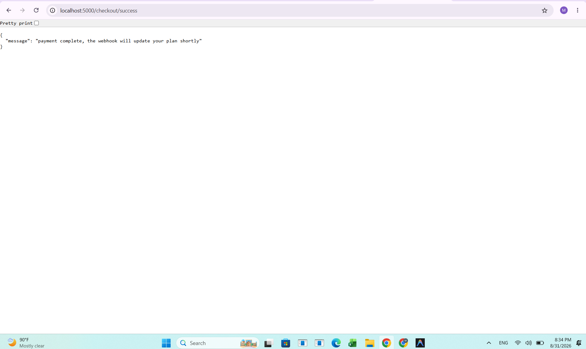
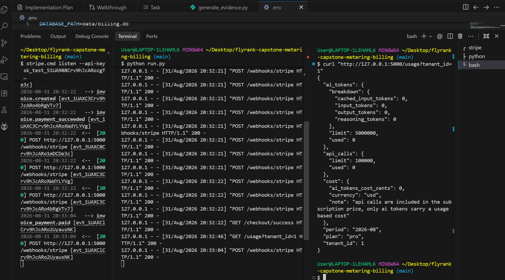

# Usage Metering and Billing Engine

A robust multi-tenant backend service implementing real-time usage metering, quota enforcement, and Stripe subscription billing. Built for the FlyRank capstone metering and billing project.

## Overview

This application manages usage-based billing and plan-limit tracking for multiple tenants. It allows tenants on a **Free** plan to upgrade to a **Pro** plan using Stripe Checkout subscriptions. Plan upgrades, updates, and cancellations are automatically kept in sync using signature-verified, idempotent Stripe webhook event handlers.

---

## Key Features

* **Multi-Tenant Isolation**: Every usage record, subscription status check, and rollup aggregates usage by `tenant_id`.
* **Flexible Usage Metering**: Supports tracking both general API calls and detailed AI token usage.
* **Intelligent AI Token Pricing**: Cost calculation applies discounts for cached input tokens, bills reasoning tokens at output rates, and avoids simple token aggregation prior to pricing.
* **Quota Enforcement**: Free tenants are blocked with HTTP `402 Payment Required` upon boundary limit breaches, while Pro tenants receive HTTP `429 Too Many Requests`.
* **Idempotent Usage Recording**: Usage events are tracked exactly once per `idempotency_key` to avoid double-billing.
* **Stripe Checkout Subscriptions**: Initiates checkout sessions with Stripe under `mode=subscription` carrying tenant references.
* **Secure Stripe Webhooks**: Verifies signatures with HMAC-SHA256 and prevents replay/duplicate event processing.
* **Auto Plan Synchronization**: Automatically handles plan upgrades, status changes, and cancellations.

---

## Architecture & Flow

```
Client
  │
  │  POST /generate  (tenant_id, idempotency_key, usage_type, quantity / tokens)
  ▼
generate route
  │
  ▼
meter_service.record_usage
  ├── idempotency_responses has this key already? ──> Return stored response, no usage added
  ├── Otherwise: look up tenant, sum current period usage, add request quantity
  ├── Total within the plan limit?
  │     ├── Yes ──> Insert usage event, return 200 OK
  │     ├── No, Free plan ──> Return 402, "upgrade to pro to continue"
  │     └── No, Pro plan  ──> Return 429, "usage quota exceeded, resets next month"
  └── Store response details in idempotency_responses

Client
  │
  │  GET /usage?tenant_id=1
  ▼
usage_service.get_usage_summary
  ├── Sums usage_events for the current billing period
  ├── Computes live AI token costs via pricing formulas
  └── Returns usage limits and cost summary

Client
  │
  │  POST /checkout  (tenant_id)
  ▼
stripe_client.create_checkout_session ──> Stripe API (Test Mode) ──> Return Checkout URL & Session ID

Stripe
  │
  │  POST /webhooks/stripe  (Signed payload)
  ▼
webhooks route
  ├── verify_webhook_signature (HMAC-SHA256), bad signature ──> Return 400 Bad Request
  └── webhook_service.apply_event
        ├── event_id already in processed_stripe_events? ──> Ignore event, return 200 (de-duplication)
        ├── checkout.session.completed ──> Upgrade tenant to 'pro', write subscription DB record
        ├── customer.subscription.updated ──> Sync tenant plan to current subscription status (active/trialing vs unpaid)
        ├── customer.subscription.deleted ──> Downgrade tenant to 'free', mark status canceled
        └── Mark event ID as processed in DB
```

---

## Metering & Pricing

### Plan Quotas
Plans and limits are configured as follow:

| Plan | API Calls / Month | AI Tokens / Month |
| :--- | :--- | :--- |
| **Free** | 1,000 | 100,000 |
| **Pro** | 100,000 | 5,000,000 |

### AI Token Pricing Model
Token pricing is calculated in cents per 1,000,000 tokens using integer division to avoid floating-point inaccuracies:

| Category | Price per Million Tokens |
| :--- | :--- |
| **Input Tokens** | 300 cents ($3.00) |
| **Cached Input Tokens** | 75 cents ($0.75) |
| **Output Tokens** | 1500 cents ($15.00) |
| **Reasoning Tokens** | 1500 cents ($15.00) (Billed at output rate) |

---

## Quota & Idempotency

* **Limit Checks**: Quota checks run *before* usage events are saved to the database. The system allows requests up to the plan limit; the first request that crosses the boundary is rejected.
* **Idempotency Responses**: The database table `idempotency_responses` caches complete response bodies and status codes. Duplicate requests with the same key bypass both limit checking and usage counting, returning the cached response with the `X-Idempotent-Replay: true` header.

---

## Stripe Subscription Checkout

The endpoint `POST /checkout` is called with a `tenant_id` payload. The service calls Stripe's `/v1/checkout/sessions` endpoint to construct a session. 

To ensure metadata is carried forward correctly, the Stripe session includes:
* `mode = subscription`
* `client_reference_id = str(tenant_id)`
* `metadata[tenant_id] = str(tenant_id)`
* Line item configured with `STRIPE_PRICE_ID_PRO`

The application relies **entirely** on Stripe webhooks to upgrade plans. Browser redirects to `/checkout/success` do not alter plan status to prevent tampering or client-side race conditions.

---

## Stripe Webhook Processing

Webhook events sent to `POST /webhooks/stripe` undergo signature validation:
1. **Signature Verification**: Validates the payload against the `Stripe-Signature` header using the webhook signing secret (`STRIPE_WEBHOOK_SECRET`) with `HMAC-SHA256`.
2. **De-duplication**: Checks the event ID against the `processed_stripe_events` table before applying the transition.
3. **Transition Rules**:
   * **`checkout.session.completed`**: Resolves `tenant_id`, upgrades the tenant plan to `pro`, and records the Stripe subscription mappings in `subscriptions` table.
   * **`customer.subscription.updated`**: Monitors active/trialing states to update the plan or downgrade to `free` (e.g. if payment fails).
   * **`customer.subscription.deleted`**: Instantly downgrades the tenant back to `free` and updates the subscription status to `canceled`.

---

## Windows Stripe CLI Integration Debugging & Resolution

During local end-to-end integration testing under Windows, we encountered a scenario where checkout creation succeeded, but the plan was not upgraded after payment completion, and no webhook logs appeared on the Flask console.

### The Issue
Windows PowerShell execution policy restricted scripts from loading, which blocked the Stripe CLI from starting:
```text
stripe : File C:\Users\User\AppData\Roaming\npm\stripe.ps1 cannot be loaded because running scripts is disabled on this system.
```
As a result, the Stripe listener command was failing silently.

### The Resolution
To bypass this policy block, we ran the command batch wrapper directly using **`stripe.cmd`** instead of `stripe`. This successfully bypassed PowerShell's script blocks.
The active webhook secret was fetched using:
```bash
stripe.cmd listen --api-key <STRIPE_SECRET_KEY> --forward-to http://127.0.0.1:5000/webhooks/stripe
```
Configuring this active secret in the `.env` file allowed Stripe to successfully forward `checkout.session.completed` events and complete the upgrade cycle locally.

---

## Testing

The automated test suite verifies billing boundaries, cost logic, idempotency, and webhook operations. Run tests using:
```bash
pytest -q
```

### Test Results
```text
27 passed in 2.70s
```

---

## Real Stripe End-to-End Verification

The complete flow was verified locally using Stripe Test Mode and the standard test card `4242 4242 4242 4242`:

```
POST /checkout (tenant_id = 1)
        │
        ▼
Stripe Checkout Session Created
        │
        ▼
Test Checkout Completed in Browser
        │
        ▼
Stripe emits checkout.session.completed
        │
        ▼
Stripe CLI forwards webhook to local Flask server
        │
        ▼
Flask verifies signature & upgrades Tenant 1 to Pro
        │
        ▼
GET /usage?tenant_id=1 returns plan: "pro"
```

---

## Screenshots

### 1. Stripe Checkout Success
This screenshot shows the successful completion of the Stripe checkout flow in Test Mode for Tenant 1:



### 2. Pro Plan Confirmation
This screenshot shows the `GET /usage` response confirming that Tenant 1 was successfully upgraded to the `pro` plan with increased limits after the webhook event was processed:



---

## Environment Configuration

Configuration variables should be defined in a private `.env` file at the project root:

```env
DATABASE_PATH=data/billing.db
PORT=5000
STRIPE_SECRET_KEY=sk_test_...
STRIPE_WEBHOOK_SECRET=whsec_...
STRIPE_PRICE_ID_PRO=price_...
STRIPE_SUCCESS_URL=http://localhost:5000/checkout/success
STRIPE_CANCEL_URL=http://localhost:5000/checkout/cancel
```

---

## Running Locally

### Terminal 1 — Stripe CLI Listener
```bash
stripe.cmd listen --api-key sk_test_... --forward-to http://127.0.0.1:5000/webhooks/stripe
```

### Terminal 2 — Flask Web Application
```bash
python run.py
```

### Terminal 3 — Interactive Verification
1. **Create Checkout Session**:
   ```bash
   curl -X POST http://127.0.0.1:5000/checkout -H "Content-Type: application/json" -d '{"tenant_id":1}'
   ```
2. Open the returned URL in your web browser and submit the test payment.
3. **Verify the plan change**:
   ```bash
   curl http://127.0.0.1:5000/usage?tenant_id=1
   ```

---

## Final Verification Summary

* **Automated Tests**: 27 Passed, 0 Failed
* **Stripe Checkout Route**: Verified (Returns checkout URL and Session ID)
* **Subscription Mode**: Verified (`mode=subscription` validated on Stripe sessions)
* **Tenant Metadata Mappings**: Verified (`client_reference_id` and `metadata.tenant_id` set correctly)
* **Webhook Signature Verification**: Verified (Verifies headers against signing secret)
* **Webhook Forwarding & Processing**: Verified (Stripe CLI routes events successfully)
* **Free → Pro Plan Upgrades**: Verified (Tenant updated to `pro` after subscription completion)
* **Webhook Event De-duplication**: Verified (Ensures Stripe events are processed only once)
